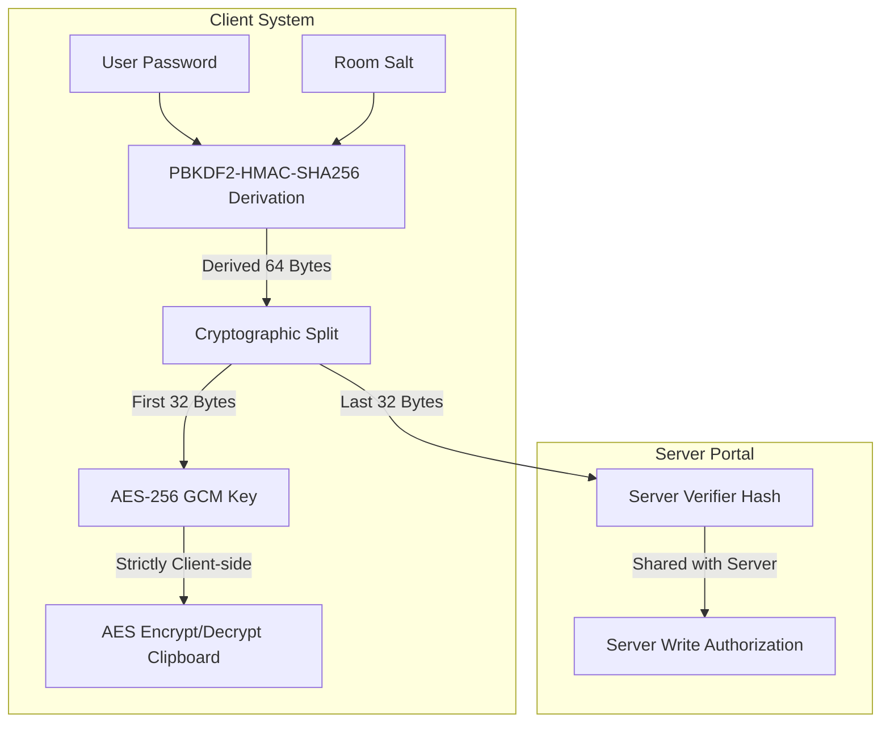

# Zero-Knowledge Clipboard Sync 🗝️📋

A secure, real-time clipboard sharing utility. It allows users to sync copy-paste buffers instantly across multiple machines. All data is encrypted client-side using **AES-256-GCM** before transmission, meaning the storage portal server only handles encrypted payloads and has zero visibility into your plaintext clipboard contents.

🔗 **Live Demo:** [https://zk-clipboard-frontend.vercel.app](https://zk-clipboard-frontend.vercel.app)

---

## 🔒 The Zero-Knowledge Cryptographic Model
To synchronize clipboard channels without exposing data to the server, this project implements a split-PBKDF2 key derivation scheme:



### Why this is secure:
1. **Zero Password Leakage:** The password is never transmitted.
2. **Zero Key Leakage:** The 32-byte AES key used for encrypting files never leaves the client's RAM.
3. **Write Authorization:** The server verifies requests using the `VerifierHash` to authenticate write operations on the channel. However, because PBKDF2 is a cryptographic one-way function, the server cannot reverse the `VerifierHash` to derive either the original password or the decryption key.

---

## 🛠️ Features
- **Client-Side AES-256-GCM:** Ensures confidentiality and cryptographic integrity checks (prevents payload tampering).
- **Split-Key PBKDF2 Derivation:** Cryptographically separates channel write authorization from channel decryption.
- **In-Memory Portability:** The lightweight Flask server processes synchronization channels in RAM for high-speed delivery.
- **Automatic Clipboard Listeners:** Daemon process monitors local clipboards and pushes updates only when text changes.
- **Polling Syncer:** Automatically retrieves, decrypts, and updates local clipboards when remote updates occur.
- **Cross-Platform:** Works on Windows, macOS, and Linux (utilizing `pyperclip`).

---

## 🚀 Quick Start

### 1. Installation
Clone the repository and install the dependencies:
```bash
# Navigate to clipboard directory
cd zk-clipboard

# Create and activate virtual environment
python -m venv .venv
source .venv/bin/activate  # On Windows: .venv\Scripts\activate

# Install requirements
pip install -r requirements.txt
```

### 2. Run the Storage Server
Start the synchronization API host (defaults to port `5002` to avoid conflicting with other services):
```bash
python server.py
```

### 3. Run the Clipboard Daemon Client
Open a new shell and start the client on your machine:
```bash
python client.py
```
1. Enter the server address (defaults to `http://localhost:5002`).
2. Input a Room Name (e.g., `ops-room`).
3. Set a Room Password (e.g., `secretpass123`).

*Now start another client on a second machine (or another terminal pane) joining the same Room Name and Password. Any text you copy on one machine will instantly populate on the other!*

---

## 🧪 Automated Tests
Run unit tests checking GCM validation, key splits, and authorization endpoints:
```bash
python -m unittest discover -s tests
```

---

## 📁 Repository Layout
- `client.py` - CLI script handling OS clipboard captures, key derivations, and decryption.
- `server.py` - Flask web API storing salts and GCM cipher blocks in memory.
- `requirements.txt` - Python module dependencies.
- `tests/` - Unit tests directory.
